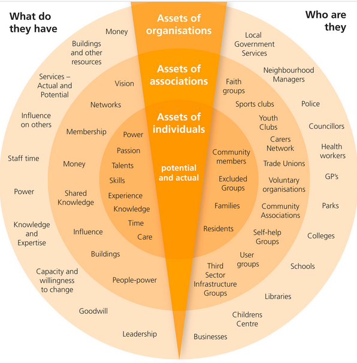
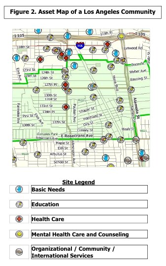

Community asset maps take many forms, from simple lists that fit on a single piece of paper to extensive reports and geographic maps. Plotting the resources and groups you discover on a map of your city or neighborhood may be useful and can inspire you to form out-of-the-box connections, but many community maps are much more simple. Look at the following examples for inspiration.

  
EXAMPLES OF COMMUNITY ASSET MAPS

  <table>
  	<tr><td style="padding:10px;text-align:center;"></td><td>There is an example of a community asset map on page 38 of <a href="https://resources.depaul.edu/abcd-institute/publications/publications-by-topic/Documents/ULCReport.pdf#page=40" target="_blank">The Engaged Library: Chicago Stories of Community Building</a> from the Urban Libraries Council.</td></tr>
  	<tr><td style="padding:10px;text-align:center;"></td><td>This map from <a href="http://www.brighterfuturestogether.co.uk/wp-content/uploads/2012/02/assets-diagram-2-large.jpg" target="_blank">Brighter Futures Together</a> depicts assets of individuals alongside those of associations and organizations in the community.</td></tr>
  	<tr><td style="padding:10px;text-align:center;"></td><td>The <a href="http://healthpolicy.ucla.edu/programs/health-data/trainings/Documents/tw_cba20.pdf#page=8" target="_blank">UCLA Center for Health Policy Research</a> locates assets are on a geographic map.</td></tr>
</table>

Your map can be small and simple or complex and far-reaching. You can choose how detailed you want your map to be based on your needs and your resources. You can also consider it an iterative process—you could start by looking only at businesses within one mile of your library, for instance, with plans to add community organizations later, and then expand to two miles.

SCALE UP OR SCALE DOWN

Since every community is different, the community mapping process will vary from library to library. A large urban library in a big city may go through an extensive process involving focus groups and interviews with dozens of community members and representatives of local organizations, but a busy “everything librarian” in a rural one-room library can benefit from a scaled-down version involving an afternoon with a search engine and some reflection. This module will teach you the principles of community mapping and suggest strategies for scaling the process up or down so you can make a plan that will fit your library, your community, and your resources.

  
THE POWER OF A SIMPLE ASSET MAP

<iframe width="560" height="315" src="https://www.youtube.com/embed/hX4pNY1S338" frameborder="0" allow="autoplay; encrypted-media" allowfullscreen></iframe>

